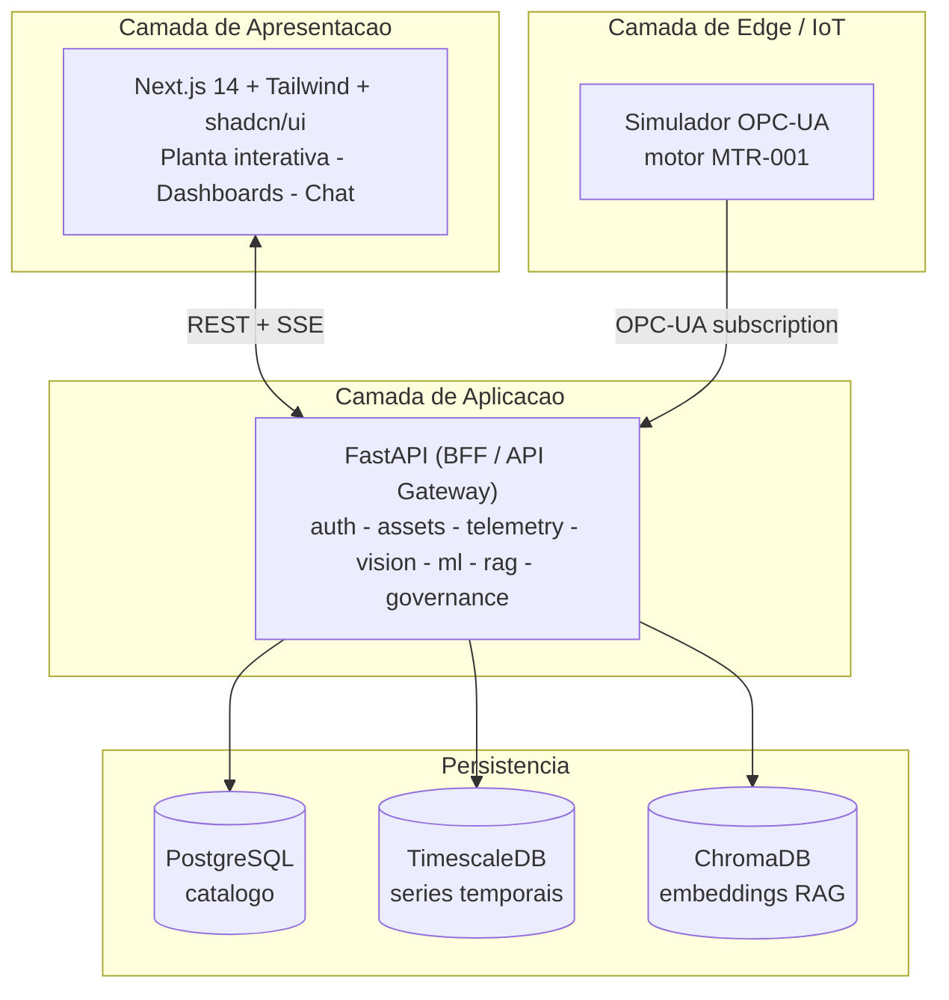

# Predicta

Plataforma de **Digital Twin** para monitoramento em tempo real e manutenção
preditiva de motores elétricos industriais (220 V trifásicos). Desenvolvida para o
**Challenge FIAP × Forzy (Promon)** pelo grupo **Predicta**.

**Demonstração no ar:** <http://128.140.71.89/> — acesso `admin` / `admin123`.

## Equipe

| Integrante | RM |
|---|---|
| Augusto Oliveira Codo de Sousa | RM502080 |
| Felipe de Oliveira Cabral | RM561720 |
| Gabriel Tonelli Avelino Dos Santos | RM564705 |
| Sofia Bueris Netto de Souza | RM565818 |
| Vinícius Adrian Siqueira de Oliveira | RM564962 |

---

## O problema

A manutenção de ativos industriais costuma ser **corretiva** ou baseada em
calendário fixo. Isso gera paradas não planejadas, custo elevado de estoque de
peças e risco de falhas catastróficas. A Forzy precisa de uma solução que:

- capture dados dos motores em tempo real (tensão, corrente, temperatura,
  rotação e vibração);
- detecte desvios de comportamento **antes** da falha;
- estime o tempo restante de vida útil (RUL) dos componentes;
- ofereça apoio à decisão para a equipe de manutenção.

## A solução

Um **gêmeo digital** que integra IoT, IA e uma interface web navegável a partir
da planta baixa do ativo:

| Capacidade | Como |
|---|---|
| Aquisição de dados | Servidor/simulador OPC-UA → cliente assíncrono → TimescaleDB |
| Visualização | Next.js 14 — planta interativa, dashboards em tempo real |
| Cadastro de ativos | CRUD + OCR da placa de identificação |
| Detecção de anomalias | ML (Isolation Forest + autoencoder MLP sobre janelas de vibração) |
| Manutenção preditiva | RUL por tendência de vibração até o limite do motor, com teto na inspeção do fabricante |
| Troubleshooting | Chat com LLM + RAG sobre manuais técnicos |
| Governança | RBAC, auditoria, classificação de dados |

## Arquitetura



Detalhes em [`docs/architecture.md`](docs/architecture.md) e nos
[ADRs](docs/adr/).

## Quickstart

Pré-requisitos: **Docker** + **Docker Compose v2**.

```bash
# 1. Entrar no diretorio do projeto
cd predicta-forzy

# 2. Criar o arquivo de ambiente
cp .env.example .env

# 3. Subir toda a stack
docker compose up -d --build

# 4. Aguardar os healthchecks (~1-2 min)
docker compose ps

# 5. Aplicar as migrations e o seed inicial
docker compose exec backend alembic upgrade head
docker compose exec backend python -m app.scripts.seed

# 6. Importar o historico real da bancada (MTR-F01 / MTR-F02).
#    Sem este passo os dois mancais sobem cadastrados e sem leitura nenhuma.
#    E idempotente: rodar de novo nao duplica dado.
docker compose exec backend python -m app.scripts.import_history data/history_forzy_iolink.csv

# 7. Acessar:
#    Frontend ......... http://localhost:3001
#    API (Swagger) .... http://localhost:8000/docs
#    OPC-UA ........... opc.tcp://localhost:4840/forzy/server/
```

Faça login com `admin` / `admin123`. Após ~1 minuto, a tela
`http://localhost:3001/asset/MTR-001` exibe o gráfico de temperatura em tempo
real. O conjunto motor-bomba da Forzy fica em `/asset/MTR-F00`, com os dois
mancais lado a lado. O assistente de manutenção (Volt) fica em `/volt` e também
como widget flutuante em qualquer tela.

## Estrutura

```
backend/    API FastAPI (auth, assets, telemetry, vision, ml, rag, governance)
frontend/   Aplicacao Next.js 14
edge/       Simulador OPC-UA + geradores de dados
ml/         Notebooks, pipelines e modelos
rag/        Ingestao e recuperacao para o chat
docs/       Arquitetura, ADRs, governanca, relatorios de sprint
assets/     Plantas, modelos 3D e amostras de placas
```

## Roadmap

| Sprint | Entrega | Status |
|---|---|---|
| 1 | Fundamentos: simulador, telemetria, cadastro, base de dados | concluída |
| 2 | Planta interativa, OCR de placas, telemetria completa | concluída |
| 3 | ML: baseline, anomalia, RUL e alertas | concluída |
| 4 | RAG conversacional, governança e deploy | concluída |

## Stack

Next.js 14 · FastAPI · PostgreSQL 16 · TimescaleDB · ChromaDB · `asyncua` ·
scikit-learn · LLM configurável (OpenAI ou Anthropic) · Docker Compose · Kubernetes.

## Documentação

- [`docs/architecture.md`](docs/architecture.md) — visão C4 da arquitetura
- [`docs/adr/`](docs/adr/) — decisões arquiteturais (ADRs)
- [`docs/sprints/`](docs/sprints/) — relatórios executivos por sprint
- [`docs/governance/`](docs/governance/) — classificação de dados e controle de acesso (RBAC)
- [`docs/demo-scenario.md`](docs/demo-scenario.md) — roteiro de demonstração ponta a ponta
- [`docs/video-script.md`](docs/video-script.md) — roteiro do vídeo de demonstração
- [`deploy/`](deploy/) — artefatos de implantação (Docker Compose de produção e Kubernetes)

## Licença

Projeto acadêmico desenvolvido para o Challenge FIAP × Forzy/Promon.
