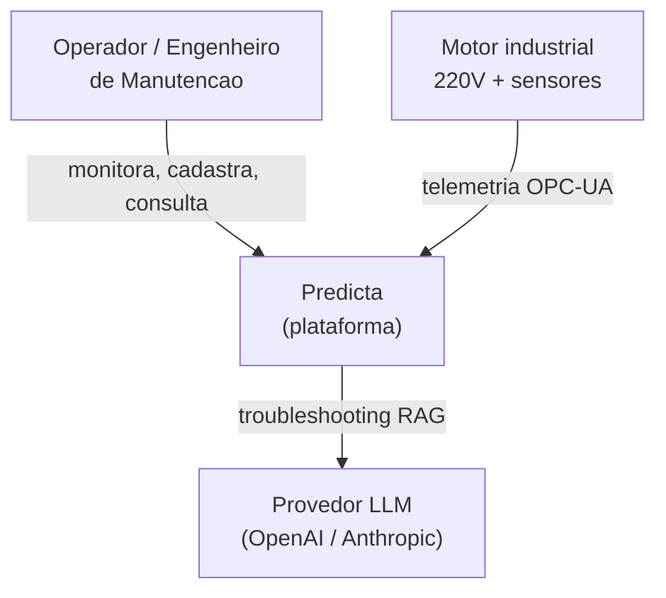
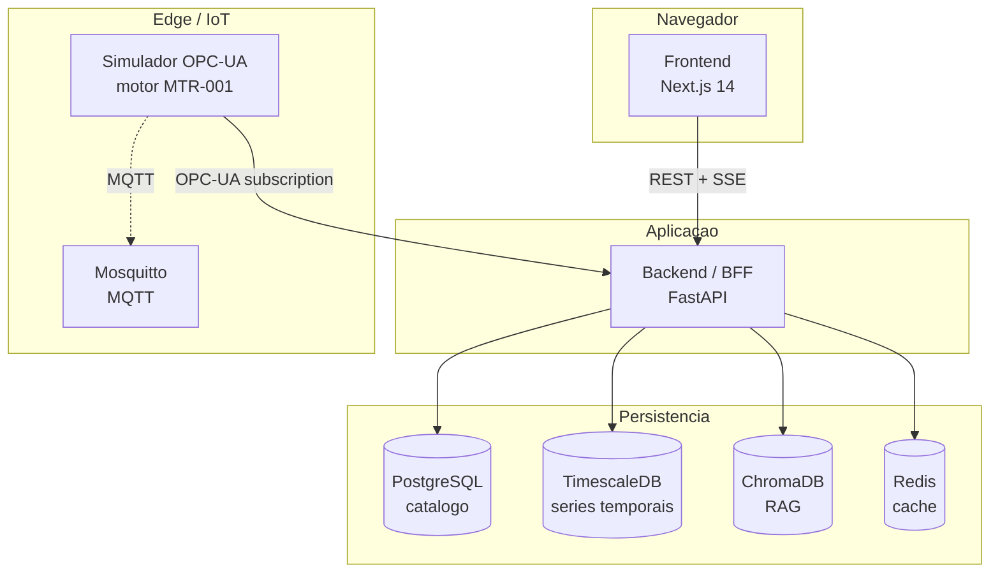
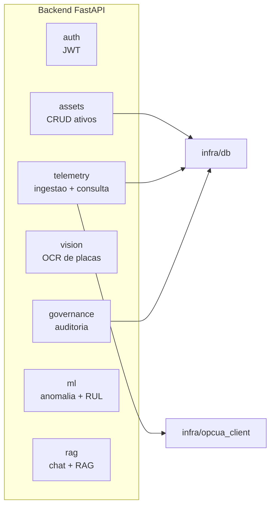
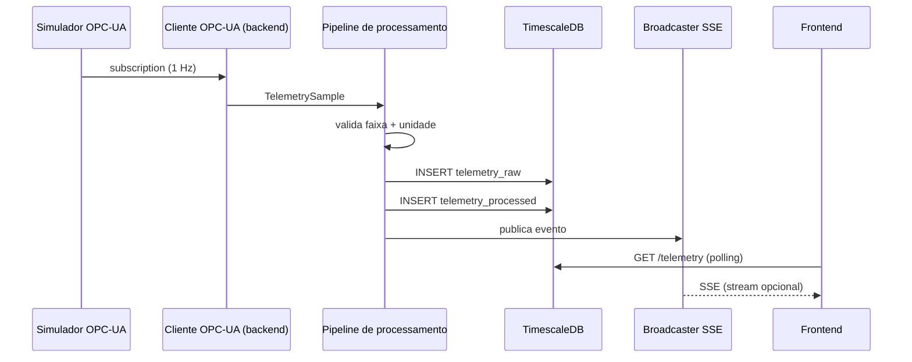

# Arquitetura — Predicta

Documento de arquitetura no modelo **C4** (Contexto → Containers → Componentes),
acompanhado do fluxo de dados e das decisões registradas nos
[ADRs](adr/).

## 1. Visão geral

A plataforma é um **gêmeo digital** de motores elétricos industriais. Captura
telemetria em tempo real via OPC-UA, persiste o histórico, aplica IA para
detecção de anomalias e oferece uma interface web navegável a partir da planta.

A solução é **modular**: cada domínio (ativos, telemetria, visão, ML, RAG,
governança) é um módulo independente, ativável por *feature flag*.

## 2. C4 — Nível 1 — Contexto

## 3. C4 — Nível 2 — Containers

## 4. C4 — Nível 3 — Componentes do backend

Cada módulo segue a estrutura `router` → `service` → `repository`, com schemas
Pydantic (`*In` / `*Out`) e modelos ORM separados.

## 5. Fluxo de dados de telemetria

## 6. Decisões arquiteturais

| ADR | Decisão |
|---|---|
| [0001](adr/0001-stack-tecnologica.md) | Stack: Next.js + FastAPI + PostgreSQL/TimescaleDB |
| [0002](adr/0002-modelo-dados-timeseries.md) | Séries temporais em hypertables; bancos separados |
| [0003](adr/0003-ocr-strategy.md) | OCR com PaddleOCR (Claude Vision como alternativa) |
| [0004](adr/0004-representacao-planta.md) | Planta autorada em SVG; marcadores dinâmicos |
| [0005](adr/0005-estrategia-ml.md) | ML com scikit-learn (Isolation Forest, autoencoder, regressão) |
| [0006](adr/0006-estrategia-rag.md) | RAG com embeddings por hashing; LLM com modo offline |
| [0007](adr/0007-rbac-governanca.md) | RBAC com hierarquia de papéis; usuários com argon2 |

## 7. Modularidade

Todo módulo é ligado/desligado por variável de ambiente `FEATURE_*`. Se
`FEATURE_ML=false`, o router de ML não é registrado e suas dependências não são
carregadas. Isso permite implantações enxutas e evolução sprint a sprint.

## 8. Segurança e governança

- **Autenticação:** JWT com expiração curta (15 min). Senhas com argon2.
- **Controle de acesso (RBAC):** papéis viewer/operator/engineer/admin aplicados
  no gateway da API; ver [access-control.md](governance/access-control.md).
- **Auditoria:** middleware registra toda requisição (log JSON) e persiste as
  operações de escrita em `audit_log`.
- **Classificação de dados:** ver [data-classification.md](governance/data-classification.md).
- **Segredos:** apenas em variáveis de ambiente; `.env` fora do versionamento.

## 9. Roadmap por sprint

| Sprint | Escopo arquitetural |
|---|---|
| 1 | Edge (simulador), ingestão, catálogo, base de dados, frontend inicial |
| 2 | Planta interativa (SVG), OCR real, telemetria completa, RPA |
| 3 | Camada de ML (baseline, anomalia, RUL), alertas, workers |
| 4 | RAG conversacional, governança final, deploy (K8s / cloud) |
